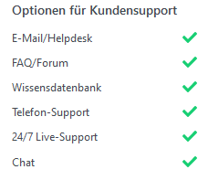
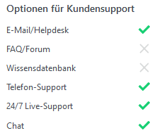
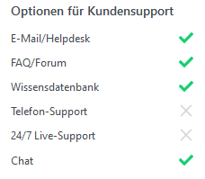
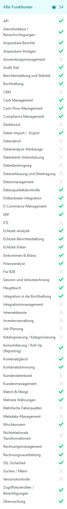
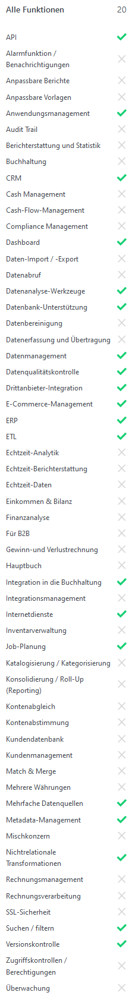
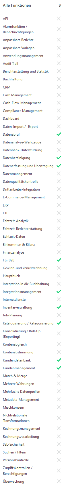
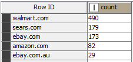

# Bearbeitung M2

## Aufgabe 1

__Quelle:__

> https://www.getapp.de/directory/1303/etl/software

> https://www.getapp.de/compare/115555/103605/a2x-for-amazon-accounting/vs/k3?vs[]=114378#overview
 
__Vergleich ETL-Software:__

| Vergleichskriterium                         | A2X                                           | K3                                           | SyncSpider                                           | 
|---------------------------------------------|-----------------------------------------------|----------------------------------------------|------------------------------------------------------|
| Nutzerbewertung (Anzahl), Stand: 07.04.2022 | 4,9 (280)                                     | 4,9 (38)                                     | 4,8 (110)                                            |
| Kosten (Beginnt ab)                         | 19,00 $/Monat                                 | Kostenlos                                    | 29,00 $/Monat                                        |
| Unterstützte Plattformen                    | Web-basiert                                   | Web-basiert, Windows App                     | Web-basiert, Windows App                             |
| Optionen für Kundensupport                  |  |  |  |
| Alle Funktionen                             |     |     |     |

## Aufgabe 3

| Part | Aufgabe                                                                                             | Antwort                   |
| ---- |-----------------------------------------------------------------------------------------------------|---------------------------|
| a)   | Wie viele Datensätze haben die order_priority = „H“ (High)                                          | 1.278                     |
| b)   | Wie viele Einheiten (units_sold) wurden in Asien (region) in Summe verkauft?                        | 3.620.036                 |
| c)   | Wie viele Einheiten (units_sold) wurden in Asien und Europa (region) in Summe verkauft?             | 10.202.358                |
| d)   | Wie viele Einheiten (units_sold) wurden im Jahr 2013 Online (sales_channel) verkauft?               | 1.734.703                 |
| e)   | Wie viele Bestellungen gab es in 2013 (order_date), die erst in 2014 (ship_date) verschickt wurden? | 39                        |
| f)   | Überprüfen Sie, ob die Spalte „total_profit“ einen Berechnungsfehler enthält.                       | Ja, insgesamt drei Fehler |

## Aufgabe 4

| Komponente            | Funktionsweise                                                                  |
|-----------------------|---------------------------------------------------------------------------------|
| Table Creator         | Der Table Creator ist besonders geeignet um Daten für Beispiele zu konstruieren |
| Sorter                | Sortiert die Zeilen nach entsprechenden nutzerabhängigen Kriterien              |
| Rule-based Row Filter | Filterung der Zeilen nach entsprechenden definierten Regeln                     |
| Concatenate           | Verkettung von zwei Tabellen zu einer Tabelle                                   |

## Aufgabe 5 + 6a)

| Part | Aufgabe                                                                      | Antwort            |
|------|------------------------------------------------------------------------------|--------------------|
| F1   | Welche Schuhfarbe kommt am häufigsten vor? Ignorieren Sie unbekannte Farben. | Black              |
| F2   | Wie häufig kommt die Schuhfarbe vor?                                         | 71                 |
| F3   | Bei welcher Marke gibt es am häufigsten bedingungslos freien Versand?        | Nike mit Anzahl 25 |

## Aufgabe 6b)

| Aufgabe                                                                                                                                          | Antwort                |
|--------------------------------------------------------------------------------------------------------------------------------------------------|------------------------|
| Aus welchen Quellen stammen die meisten Preise? Nennen Sie die Top 5 und geben Sie nur den Domain- und Top-Level-Domainname aus. (z.B. ebay.com) |  |

## Aufgabe 9

__Befehl:__ "C:\Program Files\KNIME\knime.exe" -consoleLog -noexit -nosplash -reset -application org.knime.product.KNIME_BATCH_APPLICATION -workflowDir="C:\Users\hendr\knime-workspace\Praktikum Business Intelligence\M2\M2 - Aufgabe 9" -"workflow.variable"=csv-filename,"C:\Users\hendr\PhpstormProjects\BI\Hendrik\Meilenstein 2\shell-output-task9.csv",String