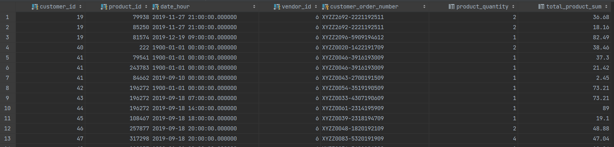
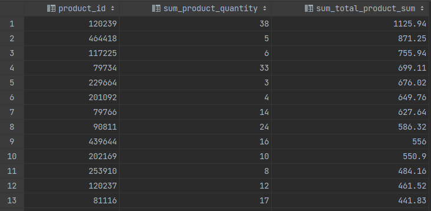
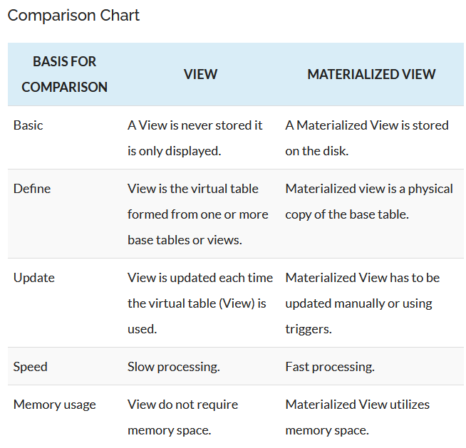

# Bearbeitung M3

## Aufgabe 1

### Beschreibung Inhalt Tabellen:

| Tabellenname                    | Beschreibung Inhalt                                                       |
|---------------------------------|---------------------------------------------------------------------------|
| ad_order                        | Alle Kundenbestellungen                                                   |
| ad_order_item                   | Alle bestellten Produkte                                                  |
| ad_order_assignment             | Verkäufer-spezifische Bestelldaten                                        |
| ad_order_assignment_item        | Alle bestellten Produkte in Bezug auf die Verkäufer                       |
| ad_order_assignment_item_refund | Rückerstattung von bestellten Produkten                                   |
| ad_order_assignment_item_log    | Historische Daten über die vergangenen Bestellungen / Bestelleinheiten    |
| vendor_ad_order_shipping        | Versandkosten für Bestellungen bei dem Verkäufer                          |
| vendor_delivery_zone            | Versandkosten für Zielländer, welche durch den Verkäufer definiert wurden |

### ER-D zum Datensatz "ApoDeals.zip"

### Frage zum Datensatz

- Ist comment für product_id in table ad_order_item nicht falsch?
> Antwort: Ja

## Aufgabe 2

### Erstellung table 'ad_order' für Aufgabe 2a)

CREATE TABLE IF NOT EXISTS ad_order (
ad_order_id INT NOT NULL PRIMARY KEY,
customer_id INT,
number VARCHAR(255),
items_total FLOAT,
shipping_total FLOAT,
adjustments_total INT,
total_in_cent INT,
currency VARCHAR(255),
notes VARCHAR(255),
checkout_completed_at TIMESTAMP,
created_at TIMESTAMP,
updated_at TIMESTAMP,
address_id INT,
ad_payment_type_id INT,
cancelled_at TIMESTAMP,
payment_status VARCHAR(255),
rrule VARCHAR(255),
child_order VARCHAR(255)
);

## Aufgabe 3

### Aufgabe 3a)

### Aufgabe 3b) + 7

CREATE TABLE IF NOT EXISTS ad_dwh.dim_product (
product_id INT NOT NULL PRIMARY KEY,
name VARCHAR(255)
) INHERITS (ad_dwh.insert_informations);

CREATE TABLE IF NOT EXISTS ad_dwh.dim_customer (
customer_id INT NOT NULL PRIMARY KEY,
name VARCHAR(255)
) INHERITS (ad_dwh.insert_informations);

CREATE TABLE IF NOT EXISTS ad_dwh.dim_vendor (
vendor_id INT NOT NULL PRIMARY KEY,
name VARCHAR(255)
) INHERITS (ad_dwh.insert_informations);

CREATE TABLE IF NOT EXISTS ad_dwh.dim_order_time (
date_hour_checkout_completed TIMESTAMP PRIMARY KEY,
year INT,
month INT,
day INT,
hour INT
) INHERITS (ad_dwh.insert_informations);

CREATE TABLE IF NOT EXISTS ad_dwh.fact_customer_sales (
date_hour_checkout_completed TIMESTAMP,
product_id INT NOT NULL,
vendor_id INT NOT NULL,
customer_id INT NOT NULL,
customer_order_number VARCHAR(255),
product_quantity INT,
total_product_sum FLOAT,
currency VARCHAR(10),

PRIMARY KEY (date_hour_checkout_completed, product_id, vendor_id, customer_id, customer_order_number),
FOREIGN KEY (product_id) REFERENCES ad_dwh.dim_product(product_id) ON DELETE SET NULL ON UPDATE CASCADE,
FOREIGN KEY (vendor_id) REFERENCES ad_dwh.dim_vendor(vendor_id) ON DELETE SET NULL ON UPDATE CASCADE,
FOREIGN KEY (customer_id) REFERENCES ad_dwh.dim_customer(customer_id) ON DELETE SET NULL ON UPDATE CASCADE,
FOREIGN KEY (date_hour_checkout_completed) REFERENCES ad_dwh.dim_order_time(date_hour_checkout_completed) ON DELETE SET NULL ON UPDATE CASCADE
) INHERITS (ad_dwh.insert_informations);

### Fragen zu 3b)

- Müssen die Fakten in der Faktentabelle immer auch Primärschlüssel sein (vgl V1-Folie 52)? Falls nicht, wäre dann also DOCH der künstliche Schlüssel 'ad_order_id' für meine Tabelle 'fact_customer_sales' besser als einziger Primärschlüssel gewesen (statt viele zu einem Primärschlüssel zu verbinden) !?
> Antwort: So wie es gelöst wurde, ist es in Ordnung. Aber falls künstlicher Schlüssel alternativ benutzt wird, dann nicht 'ad_order_id' sondern einen komplett neuen erzeugen
- Was soll der zweite Satz bezwecken? Das macht die Abfrage doch später schwieriger, falls man z.b. nur nach einem Monat filtern möchte, diesen aber nicht mit in seiner Dimensionstabelle enthalten hat.
> Antwort: Sollte nur als eine Vereinfachung der Aufgabe dienen. So wie es gelöst wurde, ist es in Ordnung.
- Da in der Fragestellung pro Stunde abgefragt wird: habe ich date_hour so in Faktentabelle --> Gäbe es keine zeitliche Frage in der Fragestellung, wäre es dann aber "richtiger" einen künstlichen Schlüssel zu benutzen statt date_hour für die Zeit (vg. V2-Folie 52) ?
> Antwort: Ja, in der Praxis wird eigentlich immer ein künstlicher Schlüssel für die Dimensionstabellen verwendet

## Aufgabe 5

| Fragestellung                                                                                                                   | SQL-Abfragen                                                                                                                                                                                                                | SQL-Ergebnisse         |
|---------------------------------------------------------------------------------------------------------------------------------|-----------------------------------------------------------------------------------------------------------------------------------------------------------------------------------------------------------------------------|------------------------|
| Welcher Kunde hat welches Produkt zu welchem Zeitpunkt (Genauigkeit: Stunde) von welchem Händler in welcher Bestellung gekauft? | SELECT customer_id, product_id, date_hour_checkout_completed, vendor_id, customer_order_number, product_quantity, total_product_sum FROM ad_dwh.fact_customer_sales order by customer_id, date_hour_checkout_completed;     |  |
| Mit welchen und wie vielen Produkten wurde wie viel Umsatz erzielt?                                                             | SELECT product_id, sum(product_quantity) as sum_product_quantity, sum(cast(total_product_sum as numeric)) as sum_total_product_sum FROM ad_dwh.fact_customer_sales GROUP BY product_id ORDER BY sum_total_product_sum DESC; |  |

## Aufgabe 6

CREATE SCHEMA ad_dwh;

SHOW search_path;
SET search_path to ad_dwh, public;

ALTER TABLE dim_customer SET SCHEMA ad_dwh;
ALTER TABLE dim_product SET SCHEMA ad_dwh;
ALTER TABLE dim_vendor SET SCHEMA ad_dwh;
ALTER TABLE dim_order_time SET SCHEMA ad_dwh;
ALTER TABLE fact_customer_sales SET SCHEMA ad_dwh;

## Aufgabe 7

CREATE TABLE ad_dwh.insert_informations (
insert_date TIMESTAMP without time zone DEFAULT current_timestamp,
insert_source VARCHAR(200) NOT NULL,

PRIMARY KEY (insert_date, insert_source)
);

## Aufgabe 9

### Aufgabe 9a)

__Quellen:__

- http://dev.usw.at/manual/postgres/Orig_DE/functions-datetime.html

| Bsp.-Nr | Funktion                        | Ergebnistyp         | Beschreibung                           | Beispiel                                            | Ergebnis                                        |
|---------|---------------------------------|---------------------|----------------------------------------|-----------------------------------------------------|-------------------------------------------------|
| 1       | age(timestamp, timestamp)       | interval            | Subtraktion                            | age('2001-04-10', timestamp '1957-06-13')           | 43 years 9 mons 27 days 0 hours 0 mins 0.0 secs |
| 2       | current_date                    | date                | heutiges Datum                         | current_date                                        | 2022-04-28                                      |
| 3       | current_time                    | time with time zone | aktuelle Zeit                          | current_time                                        | 17:06:09.260171 +00:00                          |
| 4       | date_part(text, timestamp)      | double precision    | Teilfeld ermitteln                     | date_part('hour', timestamp '2001-02-16 20:38:40')  | 20                                              |
| 5       | date_trunc(text, timestamp)     | timestamp           | auf angegebene Genauigkeit abschneiden | date_trunc('hour', timestamp '2001-02-16 20:38:40') | 2001-02-16 20:00:00.000000                      |

### Aufgabe 9b)

__Quellen:__

- https://techdifferences.com/difference-between-view-and-materialized-view.html
- https://www.postgresqltutorial.com/postgresql-views/postgresql-materialized-views/

| Frage                                                                       | Antwort                                                                                                                                                                                               |
|-----------------------------------------------------------------------------|-------------------------------------------------------------------------------------------------------------------------------------------------------------------------------------------------------|
| Wo der Unterschied zwischen einer VIEW und einer MATERIALIZED VIEW besteht? |                                                                                                                                                                                  |
| Wie wird eine MATERIALIZED VIEW erzeugt, aktualisiert und gelöscht?         | __Erzeugung:__ `CREATE MATERIALIZED VIEW view_name AS query WITH [NO] DATA;`   __Aktualisierung:__ `REFRESH MATERIALIZED VIEW view_name;`   __Löschung:__ `DROP MATERIALIZED VIEW view_name;` |

## Aufgabe 10

### Aufgabe 10a)

CREATE MATERIALIZED VIEW ad_dwh.data_completed_months
AS
SELECT f.insert_date, f.insert_source, f.date_hour_checkout_completed, product_id, vendor_id, customer_id, customer_order_number,
product_quantity, total_product_sum, currency, year, month, day, hour from ad_dwh.fact_customer_sales
as f LEFT JOIN ad_dwh.dim_order_time as o ON f.date_hour_checkout_completed = o.date_hour_checkout_completed
WHERE (o.month < date_part('month', current_date) AND o.year = date_part('year', current_date)) OR
o.year < date_part('year', current_date)
WITH DATA;

### Aufgabe 10b)

CREATE VIEW ad_dwh.data_current_month
AS
SELECT f.insert_date, f.insert_source, f.date_hour_checkout_completed, product_id, vendor_id, customer_id, customer_order_number,
product_quantity, total_product_sum, currency, year, month, day, hour from ad_dwh.fact_customer_sales
as f LEFT JOIN ad_dwh.dim_order_time as o ON f.date_hour_checkout_completed = o.date_hour_checkout_completed
WHERE o.month = date_part('month', current_date) AND o.year = date_part('year', current_date);

### Aufgabe 10c)

__1. Gründe für eine Materialized View für die Werte der vergangenen Monate:__
- Diese Daten sind schon abgeschlossen und somit sicher, da sie i. d. R. nicht mehr korrigiert werden müssen
- Die Nachteile der Materialized View (Daten nicht stets aktuell, müssen explizit erneuert werden) kommen somit nicht mehr wirklich zum tragen und können vernachlässigt werden
- Die Vorteile bestehen aber weiterhin, so kann die Datenmenge ohne Performanceverluste abgefragt und die Quellen durch viele Abfragen nicht belastet werden, da diese Art einer View ja kopiert ist

__2. Gründe für eine View für die Werte des derzeitigen Monats:__
- Die Daten des laufenden Monats sind eher unsicher, nicht abgeschlossen und werden häufig durch Neueintragungen korrigiert
- Gleichzeitig wird sehr häufig darauf zugegriffen, weshalb die Aktualität stets gewährleistet sein muss

## Aufgabe 11

### Aufgabe 11a)

| Benutzername     | Tätigkeit                                      | SELECT | INSERT | UPDATE | DELETE |
|------------------|------------------------------------------------|--------|--------|--------|--------|
| reporter_current | Fragt Daten des aktuellen Monats ab            | X      |        |        |        |
| reporter_all     | Fragt Daten aller vorherigen Monate ab         | X      |        |        |        |
| updater          | Befüllt das DWH                                | X      | X      | X      |        |
| maintenance      | Führt Backups und ggfls. Optimierungen durch   | X      | X      | X      | X      |

### Aufgabe 11b)

CREATE USER reporter_current;
CREATE USER reporter_all;
CREATE USER updater;
CREATE USER maintenance;

GRANT SELECT ON ad_dwh.data_current_month TO reporter_current;

GRANT SELECT ON ad_dwh.data_completed_months TO reporter_all;

GRANT SELECT, INSERT, UPDATE ON ALL TABLES IN SCHEMA ad_dwh TO updater;

GRANT ALL PRIVILEGES ON ALL TABLES IN SCHEMA ad_dwh TO maintenance;