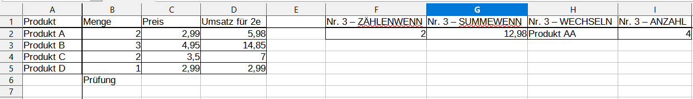
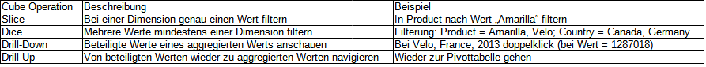

# Bearbeitung M4

## Aufgabe 2

| Aufgabe | Frage                                                                                                                                   | Antwort                                                                                                                                           |
|---------|-----------------------------------------------------------------------------------------------------------------------------------------|---------------------------------------------------------------------------------------------------------------------------------------------------|
| a)      | Was bewirkt eine Veränderung der Benutzeroberfläche (Ansicht > Benutzeroberfläche)?                                                     | Auswahl verschiedener Benutzeroberflächen-Varianten                                                                                               |
| b)      | Nennen Sie 8 Möglichkeiten, womit die Darstellung (Styling) in einer Tabelle verändert werden kann.                                     | Ränder, Hintergrundfarben, Schriftart, Schriftgröße, Ausrichtung, Zeichenfarbe, Fett, Kursiv, Unterstreichen                                      |
| c)      | Was bewirkt die Spreadsheet-Funktion „Bedingte Formatierung (Bedingung…)“ und wie kann eine Bedingung aussehen? Geben Sie ein Beispiel. | Führt entsprechende definierte Aktionen auf Zellen aus, falls diese eine Bedingung erfüllen.                          |
| d)      | Was bewirkt die Spreadsheet-Funktion „Zeilen/Spalten fixieren“? Geben Sie ein Beispiel. Nennen Sie den Vorteil dieser Funktion.         | Beim Scrollen bleiben die ausgewählten Zeilen / Spalten fix im Sichtbereich --> Vorteil: Erhöhte Übersichtlichkeit    |
| e)      | Worin liegt der Unterschied bei der Einstellung „Suchen in“ unter „Suchen & Ersetzen“ zwischen Werte und Formeln?                       | Bei "Werte" werden in den Zellen nur die dargestellten Werte durchsucht und bei "Formeln" werden alle Werte und Formeln durchsucht.               |

## Aufgabe 3

| Funktion   | Beispielanwendung              |
|------------|--------------------------------|
| ZÄHLENWENN | =ZÄHLENWENN(B2:B5;"=2")        |
| SUMMEWENN  | =SUMMEWENN(B2:B5;"=2";D$2:D$5) |
| WECHSELN   | =WECHSELN(A2;"A"; "AA")        |
| ANZAHL     | =ANZAHL(B2:B6)                 |

## Aufgabe 7

| Teil | Aufgabe                                                                | Antwort                        |
|------|------------------------------------------------------------------------|--------------------------------|
| a)   | Springe zur ersten Zeile im Tabellenblatt                              | STRG + Pfeil oben; STRG - pos1 |
| b)   | Springe zur letzten Zeile mit Daten                                    | STRG + Pfeil unten             |
| c)   | Eine Zeile/Spalte hinzufügen/löschen                                   | STRG "+"; STRG "-"             |
| d)   | Funktionsassistenten öffnen                                            | STRG + F2                      |
| e)   | Wo sind alle zugewiesenen Tastaturkürzel in der Anwendung zu finden?   | Extras -> Anpassen -> Tastatur |

## Aufgabe 9

### Aufgabe 9b)

| Titel         | Beschreibung                                     |
|---------------|--------------------------------------------------|
| Gross Sales   | Bruttoumsatz                                     |
| COGS          | Cost of Goods Sold (Kosten der verkauften Waren) |
| Discount Band | Rabattgruppe                                     |

### Aufgabe 9c)

| Frage                                        | Antwort                            |
|----------------------------------------------|------------------------------------|
| Wie wird ein negativer Profit dargestellt?   | Durch das Symbol "$()" um die Zahl |

## Aufgabe 11

### Aufgabe 11d)

| Frage                                                                                                      | Antwort                       |
|------------------------------------------------------------------------------------------------------------|-------------------------------|
| In welchem Segment besteht über die gesamte Zeit in Summe der höchste Profit? Wie hoch ist dieser Profit?  | Government mit 11.388.173,18$ |

### Aufgabe 13

