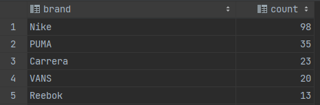
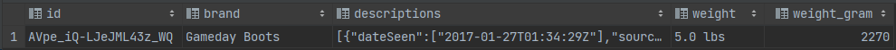
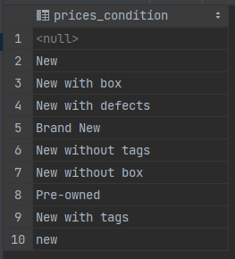
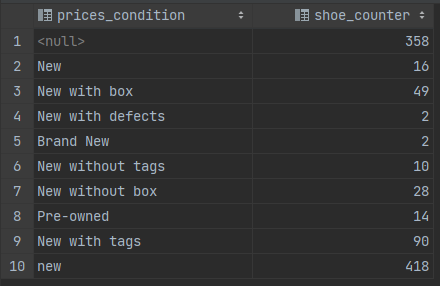
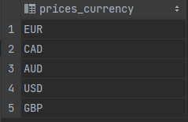
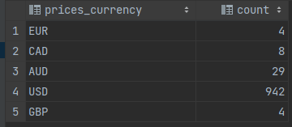
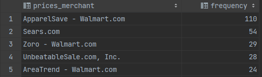
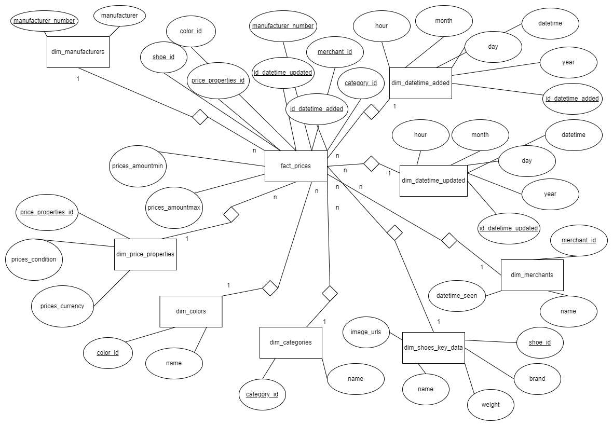
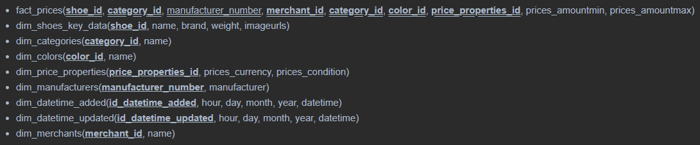

# Bearbeitung M1

## Aufgabe 1 b)

Code: "GRANT ALL PRIVILEGES ON DATABASE bi TO bi;"

## Aufgabe 2

___Dokumentation Vorgehensweise:___

- PHP Storm als Werkzeug zum Einlesen von CSV verwendet und die komplette CSV-Datei 'shoes.csv' in eine neue Datenbank 'shoes' eingelesen (vgl. VL1 - Folie 54)

## Aufgabe 3

### Aufgabe 3a)

___Teilaufgabe 1___

/ 

___Teilaufgabe 2___

- `SELECT brand, count(\*) FROM shoes GROUP BY brand ORDER BY count(\*) DESC, brand LIMIT 5;`

___Teilaufgabe 3___

### Aufgabe 3b)

___Teilaufgabe 1___

- `ALTER TABLE shoes ADD COLUMN weight_gram FLOAT;`

- `UPDATE shoes SET weight_gram = CASE WHEN split_part(weight, ' ', 2) = 'lbs' THEN split_part(weight, ' ', 1)::FLOAT * 454 ELSE split_part(weight, ' ', 1)::FLOAT END WHERE weight IS NOT NULL;`

___Teilaufgabe 2___

- Größtes Gewicht = `SELECT id, brand, name, weight, weight_gram FROM shoes WHERE weight_gram IS NOT NULL ORDER BY weight_gram DESC LIMIT 1;`

    _Alternative =_ `SELECT id, brand, name, weight, weight_gram FROM shoes WHERE weight_gram = (SELECT MAX(weight_gram) FROM shoes);`

- Geringstes Gewicht = `SELECT id, brand, name, weight, weight_gram FROM shoes WHERE weight_gram IS NOT NULL ORDER BY weight_gram LIMIT 1;`

    _Alternative =_ `SELECT id, brand, name, weight, weight_gram FROM shoes WHERE weight_gram = (SELECT MIN(weight_gram) FROM shoes);`

___Teilaufgabe 3___

- Größtes Gewicht

- Geringstes Gewicht

### Aufgabe 3c)

___Teilaufgabe 1___

/

___Teilaufgabe 2___

- `SELECT DISTINCT prices_condition FROM shoes;`

___Teilaufgabe 3___

### Aufgabe 3d)

___Teilaufgabe 1___

/

___Teilaufgabe 2___

- `SELECT prices_condition, count(*) as shoe_counter FROM shoes GROUP BY prices_condition;`

___Teilaufgabe 3___

### Aufgabe 3e)

___Teilaufgabe 1___

/

___Teilaufgabe 2___

- `SELECT DISTINCT prices_currency FROM shoes;`

___Teilaufgabe 3___

### Aufgabe 3f)

___Teilaufgabe 1___

/

___Teilaufgabe 2___

- `SELECT prices_currency, count(*) FROM shoes GROUP BY prices_currency;`

___Teilaufgabe 3___

### Aufgabe 3g)

___Teilaufgabe 1___

/

___Teilaufgabe 2___

- `SELECT id, brand, name, avg(prices_amountmax) as average_price FROM shoes WHERE prices_currency = 'USD' GROUP BY id, brand, name ORDER BY average_price DESC LIMIT 1;`

___Teilaufgabe 3___

### Aufgabe 3h)

___Teilaufgabe 1___

/

___Teilaufgabe 2___

- `SELECT prices_merchant, count(*) as frequency FROM shoes WHERE prices_merchant IS NOT NULL GROUP BY prices_merchant ORDER BY frequency DESC, prices_merchant LIMIT 5;`

___Teilaufgabe 3___

## Aufgabe 4

- Das Geschäftsmodell des Vergleichsportals ist es höchstwahrscheinlich, Werbung entweder für ihre Internetseite z. B. in sozialen Netzwerken oder für externe Unternehmen auf dem Vergleichsportal zu schalten. Des Weiteren werden sie bestimmt Vermittlungsprovisionen von dem Anbieter der jeweiligen Leistung erhalten.

## Aufgabe 5

- __Weitere Fragestellungen:__
  1. "Bei welcher Schuhmarke gibt es die kleinste Preisspanne?"
  2. "Welche Schuhmarken (Top 5) sind durchschnittlich die günstigsten bei der Währung USD?"

## Aufgabe 6

### Aufgabe 6a)

### Aufgabe 6b)

> __Legende:__ Doppelt unterstrichen => Primary Key und Foreign Key

### Aufgabe 6c)

__Teilaufgabe 1: _"Bei welcher Schuhmarke gibt es die größte Preisspanne?"___

- `SELECT shoe_id, MAX(prices_amountmax - prices_amountmin) as max_difference FROM fact_prices GROUP BY shoe_id ORDER BY max_difference DESC LIMIT 1;`

__Teilaufgabe 2: _"Bei welcher Schuhmarke gibt es die kleinste Preisspanne?"___

- `SELECT shoe_id, MIN(prices_amountmax - prices_amountmin) as min_difference FROM fact_prices GROUP BY shoe_id ORDER BY min_difference LIMIT 1;`

__Teilaufgabe 3: _"Welche Schuhmarken (Top 5) sind durchschnittlich die günstigsten bei der Währung USD?"___

- `SELECT shoe_id, name, prices_currency, avg(prices_amountmin) as average_price FROM fact_prices LEFT JOIN dim_shoes_key_data ON fact_prices.shoe_id = dim_shoes_key_data.shoe_id LEFT JOIN dim_price_properties ON fact_prices.price_properties_id = dim_price_properties.price_properties_id WHERE prices_currency = 'USD' GROUP BY shoe_id, name, prices_currency ORDER BY average_price LIMIT 5;`

## Aufgabe 7

__1. subject-oriented =__ Bei der Themenausrichtung der zu speichernden Daten handelt es sich stets um den Verkauf von Schuhen.

__2. Integrated =__ Es sind nicht genügend Informationen vorhanden, um sicher sagen zu können, ob diese Eigenschaft erfüllt ist. Man weiß nicht, woher die Daten gekommen sind und somit auch nicht, ob sie aus unterschiedlichen Vorsystemen stammen.

__3. nonvolatile =__ Es werden neue Daten regelmäßig (stündlich) in das Data Warehouse hochgeladen, welche in der Faktentabelle und den Dimensionstabelle angehängt werden und somit keine alten Werte überschreiben.

__4. time-variant =__ Die neuen Daten werden u.a. mit den Zeitdaten 'dateadded' und 'dateupdated' gespeichert, wodurch eine zeitraumbezogene Datenhaltung mit der Möglichkeit der Darstellung einer längerfristigen Entwicklung entsteht. 

## Aufgabe 8

`CREATE SCHEMA dwh_shoes AUTHORIZATION bi;`

`CREATE TABLE IF NOT EXISTS dwh_shoes.dim_manufacturers (
  manufacturer_number varchar(255) PRIMARY KEY,
  manufacturer varchar(255)
);`

`CREATE TABLE IF NOT EXISTS dwh_shoes.dim_datetime_added (
  id_datetime_added SERIAL PRIMARY KEY,
  datetime timestamp,
  year int,
  month int,
  day int,
  hour int
);`

`CREATE TABLE IF NOT EXISTS dwh_shoes.dim_datetime_updated (
  id_datetime_updated SERIAL PRIMARY KEY,
  datetime timestamp,
  year int,
  month int,
  day int,
  hour int
);`

`CREATE TABLE IF NOT EXISTS dwh_shoes.dim_merchants (
  merchant_id SERIAL PRIMARY KEY,
  name varchar(255),
  datetime_seen timestamp
);`

`CREATE TABLE IF NOT EXISTS dwh_shoes.dim_shoes_key_data (
  shoe_id varchar(255) PRIMARY KEY,
  name varchar(255),
  brand varchar(255),
  weight FLOAT,
  image_urls text
);`

`CREATE TABLE IF NOT EXISTS dwh_shoes.dim_categories (
  category_id SERIAL PRIMARY KEY,
  name varchar(255)
);`

`CREATE TABLE IF NOT EXISTS dwh_shoes.dim_colors (
  color_id SERIAL PRIMARY KEY,
  name varchar(255)
);`

`CREATE TABLE IF NOT EXISTS dwh_shoes.dim_price_properties (
  price_properties_id SERIAL PRIMARY KEY,
  prices_currency varchar(10),
  prices_condition varchar(255)
);`

`CREATE TABLE IF NOT EXISTS dwh_shoes.fact_prices (
  shoe_id varchar(255),
  manufacturer_number varchar(255),
  merchant_id int,
  category_id int,
  color_id int,
  price_properties_id int,
  id_datetime_added int,
  id_datetime_updated int,
  prices_amount_min float,
  prices_amount_max float,
  PRIMARY KEY (shoe_id, manufacturer_number, merchant_id, category_id, color_id, price_properties_id,
               id_datetime_added, id_datetime_updated),
  FOREIGN KEY (manufacturer_number) REFERENCES dwh_shoes.dim_manufacturers(manufacturer_number) ON DELETE SET NULL ON UPDATE CASCADE,
  FOREIGN KEY (id_datetime_added) REFERENCES dwh_shoes.dim_datetime_added(id_datetime_added) ON DELETE SET NULL ON UPDATE CASCADE,
  FOREIGN KEY (id_datetime_updated) REFERENCES dwh_shoes.dim_datetime_updated(id_datetime_updated) ON DELETE SET NULL ON UPDATE CASCADE,
  FOREIGN KEY (merchant_id) REFERENCES dwh_shoes.dim_merchants(merchant_id) ON DELETE SET NULL ON UPDATE CASCADE,
  FOREIGN KEY (shoe_id) REFERENCES dwh_shoes.dim_shoes_key_data(shoe_id) ON DELETE SET NULL ON UPDATE CASCADE,
  FOREIGN KEY (category_id) REFERENCES dwh_shoes.dim_categories(category_id) ON DELETE SET NULL ON UPDATE CASCADE,
  FOREIGN KEY (color_id) REFERENCES dwh_shoes.dim_colors(color_id) ON DELETE SET NULL ON UPDATE CASCADE,
  FOREIGN KEY (price_properties_id) REFERENCES dwh_shoes.dim_price_properties(price_properties_id) ON DELETE SET NULL ON UPDATE CASCADE
);`
