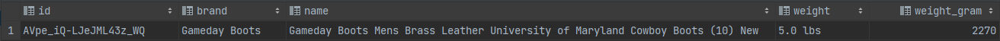
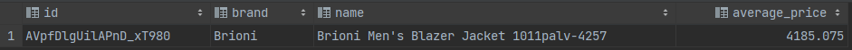

# Bearbeitung M1

## Aufgabe 1 b)

Code: "GRANT ALL PRIVILEGES ON DATABASE bi TO bi;"

## Aufgabe 2

___Dokumentation Vorgehensweise:___

PHP Storm als Werkzeug zum Einlesen von CSV verwendet und die komplette CSV-Datei 'shoes.csv' in eine neue Datenbank 'shoes' eingelesen (vgl. VL1 - Folie 54)

## Aufgabe 3

### Aufgabe 3a)

___Teilaufgabe 1___

/ 

___Teilaufgabe 2___

- SELECT brand, count(\*) FROM shoes GROUP BY brand ORDER BY count(\*) DESC, brand LIMIT 5;

___Teilaufgabe 3___

### Aufgabe 3b)

___Teilaufgabe 1___

- ALTER TABLE shoes ADD COLUMN weight_gram FLOAT;

- UPDATE shoes SET weight_gram = CASE WHEN split_part(weight, ' ', 2) = 'lbs' THEN split_part(weight, ' ', 1)::FLOAT * 454 ELSE split_part(weight, ' ', 1)::FLOAT END WHERE weight IS NOT NULL;

___Teilaufgabe 2___

- Größtes Gewicht = SELECT id, brand, descriptions, weight, weight_gram FROM shoes WHERE shoes.weight_gram IS NOT NULL ORDER BY weight_gram DESC LIMIT 1;

- Geringstes Gewicht = SELECT id, brand, descriptions, weight, weight_gram FROM shoes WHERE shoes.weight_gram IS NOT NULL ORDER BY weight_gram LIMIT 1;

___Teilaufgabe 3___

- Größtes Gewicht

- Geringstes Gewicht

### Aufgabe 3c)

___Teilaufgabe 1___

/

___Teilaufgabe 2___

- SELECT DISTINCT prices_condition FROM shoes;

___Teilaufgabe 3___

### Aufgabe 3d)

___Teilaufgabe 1___

/

___Teilaufgabe 2___

- SELECT prices_condition, count(*) as shoe_counter FROM shoes GROUP BY prices_condition

___Teilaufgabe 3___

### Aufgabe 3e)

___Teilaufgabe 1___

/

___Teilaufgabe 2___

- SELECT DISTINCT prices_currency FROM shoes;

___Teilaufgabe 3___

### Aufgabe 3f)

___Teilaufgabe 1___

/

___Teilaufgabe 2___

- SELECT prices_currency, count(*) FROM shoes GROUP BY prices_currency;

___Teilaufgabe 3___

### Aufgabe 3g)

___Teilaufgabe 1___

/

___Teilaufgabe 2___

- SELECT id, brand, descriptions, avg(prices_amountmin) as average_price FROM shoes WHERE prices_currency = 'USD' GROUP BY id, brand, descriptions ORDER BY average_price DESC LIMIT 1;

___Teilaufgabe 3___

### Aufgabe 3h)

___Teilaufgabe 1___

/

___Teilaufgabe 2___

- SELECT prices_merchant, count(*) as frequency FROM shoes WHERE prices_merchant IS NOT NULL GROUP BY prices_merchant ORDER BY frequency DESC, prices_merchant LIMIT 5;

___Teilaufgabe 3___

